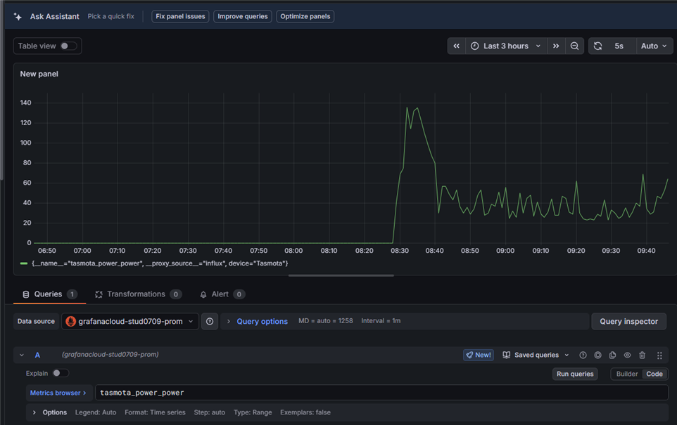

# Tasmota to Grafana Cloud (Prometheus) Telemetry

## TL;DR
This project provides an autonomous Berry script (`grafana_push.be`) for Tasmota-based smart plugs. It actively polls the device's energy sensors and pushes the data directly to Grafana Cloud's Prometheus endpoint via InfluxDB Line Protocol. No intermediate MQTT broker, Node-RED, or Prometheus scrape server is required.



## Bird's Eye View
Traditionally, Tasmota devices broadcast JSON payloads over MQTT (`tele#SENSOR`), which are then translated and scraped by Prometheus. 
This script bypasses that entirely:
1. **Timer-Based Polling:** A non-blocking background timer polls Tasmota's internal `Status 8` state every 60 seconds (configurable).
2. **Payload Construction:** It extracts voltage, current, and power metrics, formatting them safely into InfluxDB Line Protocol (e.g., `tasmota_power,device=Tasmota voltage=216,current=0.01...`).
3. **Direct Ingestion:** Using Tasmota's native `webclient`, it authenticates and pushes the payload directly to the Grafana Cloud remote write endpoint. Grafana Cloud's endpoint automatically converts the InfluxDB line protocol fields into distinct Prometheus metrics (e.g., `tasmota_power_voltage`, `tasmota_power_power`).

## Setup Guide

### 1. Grafana Cloud Setup
Before deploying the script, you need to configure your Grafana Cloud environment to accept incoming metrics.

#### Create an Access Policy & Token
1. In Grafana Cloud, go to **Administration** -> **Users and Access** -> **Access Policies**.
2. Create a new access policy (e.g., `tasmota-metrics-pusher`).
3. Grant it the **Metrics Publisher** scope.
4. Generate a new Token for this policy and securely copy the generated string. This is your API Key (Password).

#### Locate your Prometheus Endpoint & Username
1. Go to your Grafana Cloud Portal and click on **Prometheus** (Details).
2. Find the **Remote Write Endpoint** URL (e.g., `https://prometheus-prod-24-prod-eu-west-2.grafana.net`).
3. Take note of your **Username / Instance ID** (e.g., `1784001`).

### 2. Tasmota Script Configuration
Open `grafana_push.be` in a text editor and locate the configuration section at the top of the file:
```berry
# --- CONFIGURATION ---
self.endpoint = "https://prometheus-prod-24-prod-eu-west-2.grafana.net"
self.push_interval = 60000  # Telemetry push interval in milliseconds

var username = "YOUR_GRAFANA_USERNAME"
var api_key = "YOUR_GRAFANA_API_TOKEN"
```
Update these variables with the credentials you gathered from Grafana Cloud. The script will automatically calculate the Base64 Basic Auth header for you.

### 3. Tasmota Deployment
You need to upload the script to the Tasmota Universal File System (UFS).

1. Open your Tasmota Web UI and go to **Consoles** -> **Manage File system**.
2. Upload the `grafana_push.be` file.
3. Upload the `autoexec.be` file. This file contains a single line (`load("grafana_push.be")`) which ensures the script automatically starts whenever the plug boots up or recovers from a power outage.

Once uploaded, you can reboot the plug or manually start the script from the Tasmota Console:
```
BR load("grafana_push.be")
```

### 4. Verifying Data in Grafana
In Grafana, go to the **Explore** tab and select your Prometheus data source. Search for your metrics. Because of the Prometheus translation from InfluxDB Line Protocol, your fields will appear as distinct metrics:
- `tasmota_power_power`
- `tasmota_power_voltage`
- `tasmota_power_current`
- `tasmota_power_total`
- `tasmota_power_apparent_power`
- `tasmota_power_reactive_power`
- `tasmota_power_factor`

You can filter by your device name using the `device` tag:
```promql
tasmota_power_power{device="Tasmota"}
```
